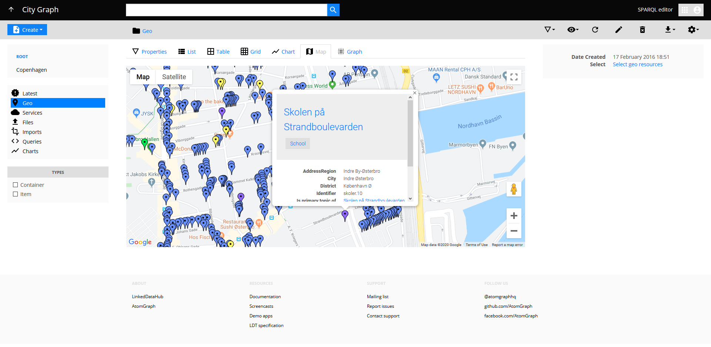

# LinkedDataHub applications

System, demo, and user-submitted applications built on LinkedDataHub. Completely data-driven, no code involved (besides the shell scripts).

## Prerequisites

The installation scripts in this repository use [LinkedDataHub's CLI scripts](https://atomgraph.github.io/LinkedDataHub/linkeddatahub/docs/reference/command-line-interface/). You need to add the `bin` (and its subfolders) of your LinkedDataHub fork or clone to `$PATH`, for example:

```shell
export PATH="$(find bin -type d -exec realpath {} \; | tr '\n' ':')$PATH"
```

__Note that app installation scripts are not idempotent. Subsequent runs might continue adding data but are not guaranteed to succeed.__

## Apps

### Documentation

**The documentation of LinkedDataHub open-source and Cloud versions.**

<dl>
    <dt>Source</dt>
    <dd><a href="linkeddatahub/docs/">linkeddatahub/docs/</a></dd>
    <dt>Features</dt>
    <dd>XHTML document content is rendered from RDF literals</dd>
    <dt>Lines of code</dt>
    <dd>0 lines of imperative code</dd>
    <dd>164 lines of installation shell scripts</dd>
</dl>

### Northwind Traders

 navigation")

**Knowledge Graph representation of the [Northwind Traders](https://powerapps.microsoft.com/en-us/blog/northwind-traders-relational-data-sample/) sample database.**

<dl>
    <dt>Source</dt>
    <dd><a href="demo/northwind-traders/" target="_blank">demo/northwind-traders/</a></dd>
    <dt>Live instance</dt>
    <dd><a href="https://linkeddatahub.com/demo/northwind-traders/" target="_blank">https://linkeddatahub.com/demo/northwind-traders/</a></dd>
    <dt>Features</dt>
    <dd>Faceted search</dd>
    <dd>Related results (parallax navigation)</dd>
    <dd>Custom <code>SELECT</code> query for each container that includes links to related resources (1:N relationships) from which faceted search options are generated</dd>
    <dd><a href="https://atomgraph.github.io/LinkedDataHub/linkeddatahub/docs/reference/imports/csv/" target="_blank">Import from CSV</a></dd>
    <dt>Lines of code</dt>
    <dd>0 lines of imperative code</dd>
    <dd>681 lines of SPARQL</dd>
    <dd>951 lines of installation shell scripts</dd>
</dl>

### City Graph



**Browser of Copenhagen's geospatial open data, imported from [Copenhagen Open Data](https://data.kk.dk/). Provides a type-colored geospatial overview. Geo resources provide a view with neighbouring resources included.**

<dl>
    <dt>Source</dt>
    <dd><a href="demo/copenhagen/" target="_blank">demo/copenhagen/</a></dd>
    <dt>Live instance</dt>
    <dd><a href="https://copenhagen.demo.linkeddatahub.com/" target="_blank">https://copenhagen.demo.linkeddatahub.com/</a></dd>
    <dt>Features</dt>
    <dd><a href="https://atomgraph.github.io/LinkedDataHub/linkeddatahub/docs/reference/imports/csv/" target="_blank">Import from CSV</a></dd>
    <dt>Lines of code</dt>
    <dd>0 lines of imperative code</dd>
    <dd>535 lines of SPARQL</dd>
    <dd>488 lines of installation shell scripts</dd>
</dl>

### Unesco Thesaurus


**Basic SKOS editor with a custom UI theme. Concepts, collections and concept schemas can be created, edited, and linked with each other. SKOS types have dedicated content templates; constructors are auto-generated during ontology import; constraints are added using CLI script.**

<dl>
    <dt>Source</dt>
    <dd><a href="demo/unesco-thesaurus/" target="_blank">demo/unesco-thesaurus/</a></dd>
    <dt>Live instance</dt>
    <dd><a href="https://unesco-thesaurus.demo.linkeddatahub.com/" target="_blank">https://unesco-thesaurus.demo.linkeddatahub.com/</a></dd>
    <dt>Features</dt>
    <dd><a href="https://atomgraph.github.io/LinkedDataHub/linkeddatahub/docs/reference/stylesheets/" target="_blank">Custom stylesheet</a></dd>
    <dd><a href="https://atomgraph.github.io/LinkedDataHub/linkeddatahub/docs/reference/administration/ontologies/#classes" target="_blank">Classes</a></dd>
    <dd><a href="https://atomgraph.github.io/LinkedDataHub/linkeddatahub/docs/reference/administration/ontologies/#constructors" target="_blank">Constructors</a></dd>
    <dd><a href="https://atomgraph.github.io/LinkedDataHub/linkeddatahub/docs/reference/administration/ontologies/#constraints" target="_blank">Constraints</a></dd>
    <dt>Lines of code</dt>
    <dd>0 lines of imperative code</dd>
    <dd>107 lines of SPARQL</dd>
    <dd>499 lines of installation shell scripts</dd>
    <dd>60 lines of XSLT stylesheet</dd>
</dl>

__You need to request append/write access to be able to create/edit the data.__

## Packages

**Reusable vocabulary packages that add domain-specific functionality to LinkedDataHub dataspaces.**

Packages provide ontology imports and custom XSLT templates for rendering specific RDF vocabularies. They use **installation-time composition** - integrating content during installation via JAX-RS endpoints rather than loading dynamically at runtime.

### Structure

Each package consists of:
- **`ns.ttl`** - Ontology with vocabulary imports (`owl:imports`) and template blocks (`ldh:template`)
- **`layout.xsl`** - XSLT stylesheet with custom rendering templates using system modes

### Installation

Packages are installed via CLI or from application install scripts:

```bash
install-package.sh \
  -b https://localhost:4443/ \
  -f ssl/owner/cert.pem \
  -p Password \
  --package https://packages.linkeddatahub.com/skos/#this
```

Installation integrates the package by:
1. Downloading and storing the ontology as a SPARQL document
2. Adding `owl:imports` to the namespace ontology
3. Saving the stylesheet and updating master stylesheets with `xsl:import`
4. Clearing caches to load the new content

### Available Packages

- **[skos](packages/skos/)** - SKOS vocabulary support (concepts, schemes, collections)

### Architecture

- **Declarative only** - RDF + XSLT, no Java code
- **Installation-time composition** - Pre-composed before loading, no runtime overhead
- **Template blocks** (`ldh:template`) - SPARQL-based views attached to RDF types
- **XSLT overrides** - Custom rendering using system modes (`bs2:*`, `xhtml:*`, etc.)

[Read the full packages documentation →](packages/README.md)
