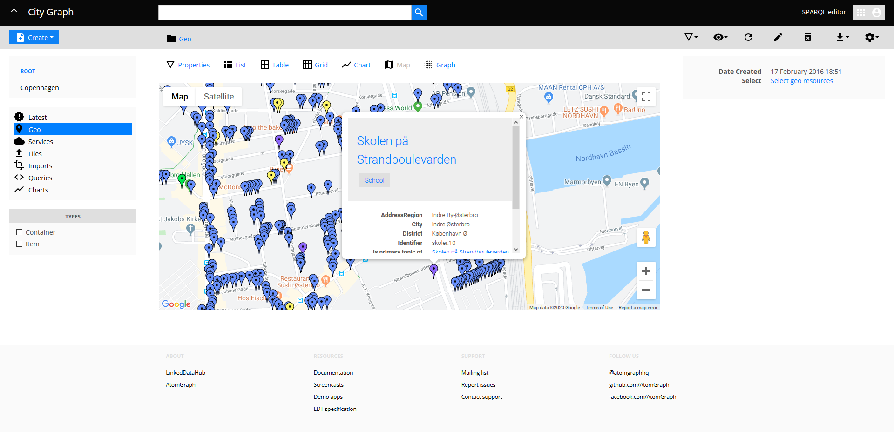
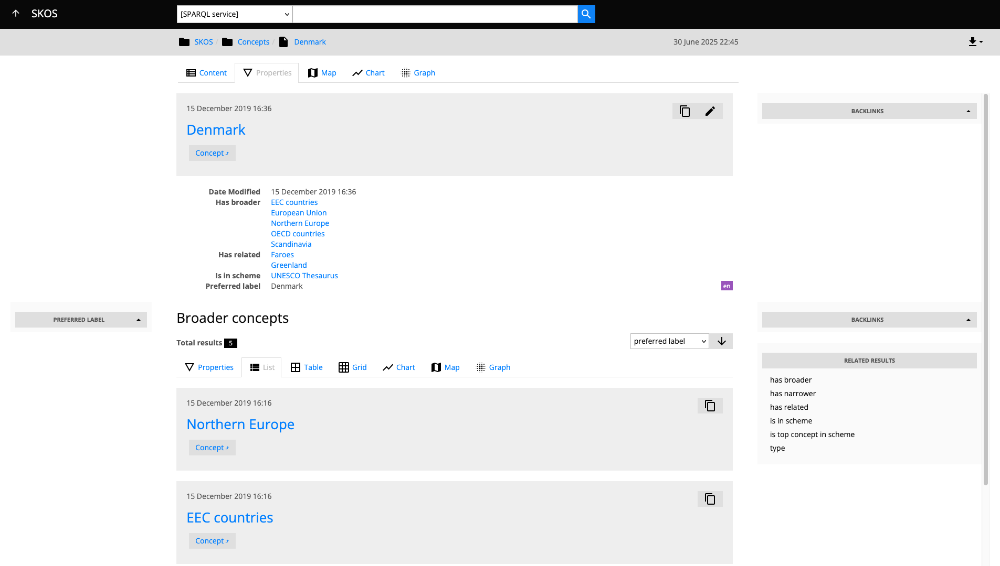
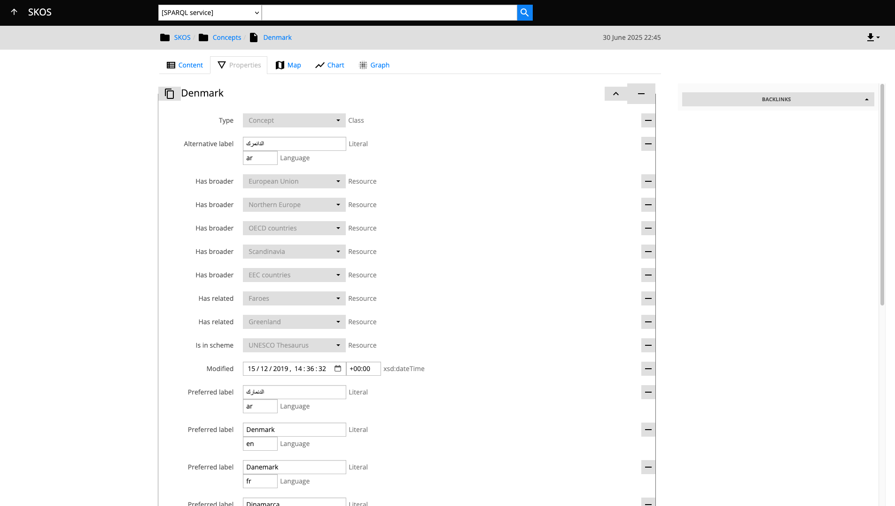

# LinkedDataHub applications

System, demo, and user-submitted applications built on LinkedDataHub. Completely data-driven, no code involved (besides the shell scripts).

## Prerequisites

The installation scripts in this repository use [LinkedDataHub's `ldh` CLI](https://atomgraph.github.io/LinkedDataHub/linkeddatahub/docs/reference/command-line-interface/). Build it from your LinkedDataHub fork or clone and put it on `$PATH`:

```shell
cd ../LinkedDataHub/cli && mvn package && export PATH="$PWD/bin:$PATH"
```

The `bin` shell scripts that `ldh` replaces are deprecated. The certificate and WebID tooling in `bin` (`webid-keygen.sh`, `server-cert-gen.sh` and friends) talks to no API and is not.

__Note that app installation scripts are not idempotent. Subsequent runs might continue adding data but are not guaranteed to succeed.__

## Apps

### Documentation

**The documentation of LinkedDataHub open-source and Cloud versions.**

<dl>
    <dt>Source</dt>
    <dd><a href="docs/">docs/</a></dd>
    <dt>Live instance</dt>
    <dd><a href="https://docs.linkeddatahub.com/" target="_blank">https://docs.linkeddatahub.com/</a></dd>
    <dt>Features</dt>
    <dd>XHTML document content is rendered from RDF literals</dd>
    <dt>Lines of code</dt>
    <dd>0 lines of imperative code</dd>
    <dd>164 lines of installation shell scripts</dd>
</dl>

#### Screenshots and screen recordings

The documentation's images and clips are not taken by hand. Every
`div.screenshot-placeholder` in the `.ttl` sources is a slot in
[`screencast/docs/manifest.mjs`](screencast/docs/manifest.mjs), which binds it to a
scripted Playwright run against a live dataspace — so a shot is reproducible, and a
slot that cannot be shot against the demo data says why instead of going missing.

```shell
cd screencast
node docs/shoot.mjs --base … --cert-file … --cert-password-file …   # into docs/out/
make docs-publish                                                   # into ../docs/
```

The shoot writes masters — 2880px lossless PNG, a `.webm` and an `.mp4` per clip.
`make docs-publish` derives the shipping copies into `docs/`, converting the stills
to WebP at twice the docs' content width and copying the already-optimised `.mp4`s,
then prints each published file's SHA-1. That hash is its address: uploads are
content-addressed at `{base}uploads/{sha1}`, so the bytes have to be final before
anything references them. The references themselves are plain XHTML in the literal
bodies — `` and `<video src="../../uploads/{sha1}">`
— and `docs/install.sh` uploads the files along with the documents.

[More on the recording rig →](screencast/README.md)

### Northwind Traders

 navigation")

**Knowledge Graph representation of the [Northwind Traders](https://powerapps.microsoft.com/en-us/blog/northwind-traders-relational-data-sample/) sample database.**

<dl>
    <dt>Source</dt>
    <dd><a href="demo/northwind-traders/" target="_blank">demo/northwind-traders/</a></dd>
    <dt>Live instance</dt>
    <dd><a href="https://northwind-traders.demo.linkeddatahub.com/" target="_blank">https://northwind-traders.demo.linkeddatahub.com/</a></dd>
    <dt>Features</dt>
    <dd>Faceted search</dd>
    <dd>Related results (parallax navigation)</dd>
    <dd>Custom <code>SELECT</code> query for each container that includes links to related resources (1:N relationships) from which faceted search options are generated</dd>
    <dd><a href="https://atomgraph.github.io/LinkedDataHub/linkeddatahub/docs/reference/imports/csv/" target="_blank">Import from CSV</a></dd>
    <dt>Lines of code</dt>
    <dd>0 lines of imperative code</dd>
    <dd>681 lines of SPARQL</dd>
    <dd>951 lines of installation shell scripts</dd>
</dl>

### City Graph



**Browser of Copenhagen's geospatial open data, imported from [Copenhagen Open Data](https://data.kk.dk/). Provides a type-colored geospatial overview. Geo resources provide a view with neighbouring resources included.**

<dl>
    <dt>Source</dt>
    <dd><a href="demo/copenhagen/" target="_blank">demo/copenhagen/</a></dd>
    <dt>Live instance</dt>
    <dd><a href="https://copenhagen.demo.linkeddatahub.com/" target="_blank">https://copenhagen.demo.linkeddatahub.com/</a></dd>
    <dt>Features</dt>
    <dd><a href="https://atomgraph.github.io/LinkedDataHub/linkeddatahub/docs/reference/imports/csv/" target="_blank">Import from CSV</a></dd>
    <dt>Lines of code</dt>
    <dd>0 lines of imperative code</dd>
    <dd>535 lines of SPARQL</dd>
    <dd>488 lines of installation shell scripts</dd>
</dl>

### Unesco Thesaurus




**Basic SKOS editor with a custom UI theme. Concepts, collections and concept schemas can be created, edited, and linked with each other. SKOS types have dedicated content templates; constructors are auto-generated during ontology import; constraints are added using CLI script.**

<dl>
    <dt>Source</dt>
    <dd><a href="demo/unesco-thesaurus/" target="_blank">demo/unesco-thesaurus/</a></dd>
    <dt>Live instance</dt>
    <dd><a href="https://unesco-thesaurus.demo.linkeddatahub.com/" target="_blank">https://unesco-thesaurus.demo.linkeddatahub.com/</a></dd>
    <dt>Features</dt>
    <dd><a href="https://atomgraph.github.io/LinkedDataHub/linkeddatahub/docs/reference/stylesheets/" target="_blank">Custom stylesheet</a></dd>
    <dd><a href="https://atomgraph.github.io/LinkedDataHub/linkeddatahub/docs/reference/administration/ontologies/#classes" target="_blank">Classes</a></dd>
    <dd><a href="https://atomgraph.github.io/LinkedDataHub/linkeddatahub/docs/reference/administration/ontologies/#constructors" target="_blank">Constructors</a></dd>
    <dd><a href="https://atomgraph.github.io/LinkedDataHub/linkeddatahub/docs/reference/administration/ontologies/#constraints" target="_blank">Constraints</a></dd>
    <dt>Lines of code</dt>
    <dd>0 lines of imperative code</dd>
    <dd>107 lines of SPARQL</dd>
    <dd>499 lines of installation shell scripts</dd>
    <dd>60 lines of XSLT stylesheet</dd>
</dl>

__You need to request append/write access to be able to create/edit the data.__

## Packages

**Reusable vocabulary packages that add domain-specific functionality to LinkedDataHub dataspaces.**

Packages provide ontology imports and custom XSLT templates for rendering specific RDF vocabularies. They are **composed at request time** out of a declaration: a single `ldh:import` triple in the application's settings, resolved on the next request.

### Structure

Each package consists of:
- **`ns.ttl`** - Ontology with vocabulary imports (`owl:imports`) and property views (`ldh:view` / `ldh:inverseView`)
- **A stylesheet** - XSLT with custom rendering templates using system modes. The filename is whatever the package's `ac:stylesheet` names.

### Installation

The declaration *is* the installation:

```bash
ldh packages list
ldh packages add --package https://packages.linkeddatahub.com/editor/taxonomy/#this
```

From the next request onwards the server resolves it: the package ontology joins the application's `owl:imports` closure, and its stylesheet is composed into the application stylesheet. No restart, and nothing is copied into the webapp.

### Available Packages

- **[editor/taxonomy](packages/editor/taxonomy/)** - Taxonomy editing on SKOS (concepts, schemes, collections)

### Architecture

- **Declarative only** - RDF + XSLT, no Java code
- **Request-time composition** - resolved from the `ldh:import` declaration, nothing copied into the webapp
- **Property views** (`ldh:view` / `ldh:inverseView`) - SPARQL-based views attached to properties
- **XSLT overrides** - Custom rendering using system modes (`ac:*`, `ldh:*`, `xhtml:*`, etc.)

[Read the full packages documentation →](packages/README.md)
