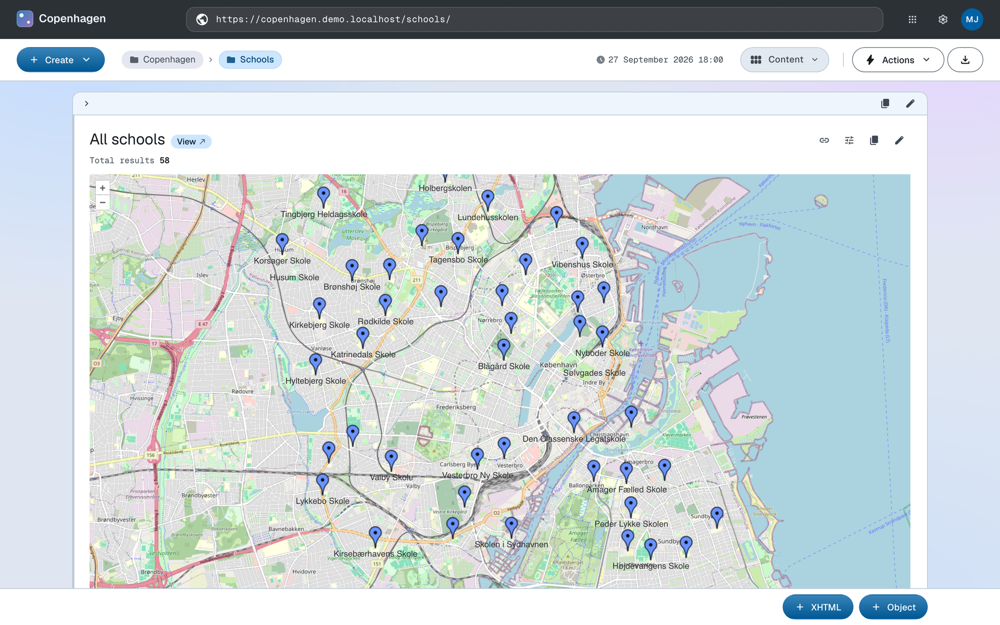
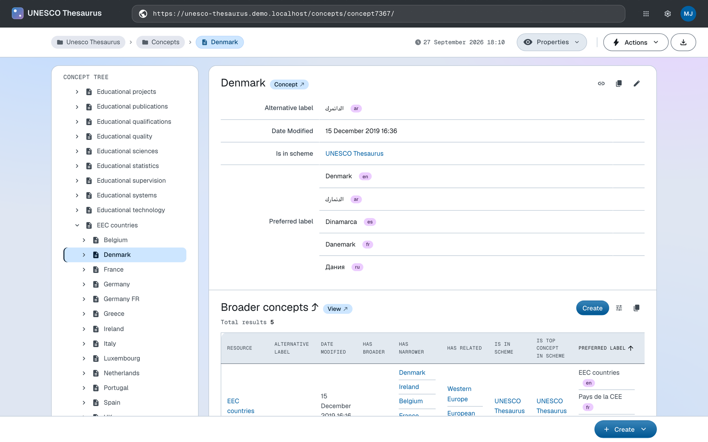
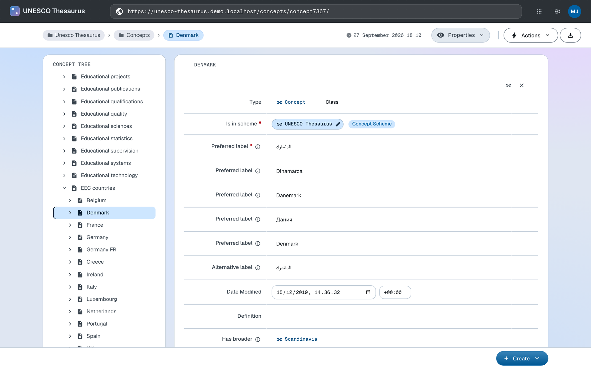

# LinkedDataHub dataspaces

System, demo, and user-submitted dataspaces built on LinkedDataHub. Completely data-driven, no code involved (besides the shell scripts).

## Prerequisites

The installation scripts in this repository use [LinkedDataHub's `ldh` CLI](https://atomgraph.github.io/LinkedDataHub/linkeddatahub/docs/reference/command-line-interface/). Build it from your LinkedDataHub fork or clone and put it on `$PATH`:

```shell
cd ../LinkedDataHub/cli && mvn package && export PATH="$PWD/bin:$PATH"
```

`make install` prompts for the base URL, the owner's keystore, its password and an optional proxy URL, exports them as the `LDH_*` variables the CLI reads, and runs the app's `install.sh` — every installer sources the shared [`lib/ldh-app.sh`](lib/ldh-app.sh). To install unattended, export the variables and run `./install.sh`.

__Re-running an install converges but is not clean: `ldh push` replaces each document and the namespace ontology is reset before re-import, but `make-public`, `create authorization` and every import are POSTs, so each run adds another authorization and another import record.__

## Apps

### Documentation

**The documentation of LinkedDataHub open-source and Cloud versions.**

<dl>
    <dt>Source</dt>
    <dd><a href="docs/">docs/</a></dd>
    <dt>Live instance</dt>
    <dd><a href="https://docs.linkeddatahub.com/" target="_blank">https://docs.linkeddatahub.com/</a></dd>
    <dt>Features</dt>
    <dd>XHTML document content is rendered from RDF literals</dd>
    <dt>Lines of code</dt>
    <dd>0 lines of imperative code</dd>
    <dd>19 lines of installation shell script</dd>
</dl>

#### Screenshots and screen recordings

The documentation's images and clips are not taken by hand. Every
`div.screenshot-placeholder` in the `.ttl` sources is a slot in
[`screencast/docs/manifest.mjs`](screencast/docs/manifest.mjs), which binds it to a
scripted Playwright run against a live dataspace — so a shot is reproducible, and a
slot that cannot be shot against the demo data says why instead of going missing.

```shell
cd screencast
node docs/shoot.mjs --base … --cert-file … --cert-password-file …   # into docs/out/
make docs-publish                                                   # into ../docs/
make docs-fill                                                      # point the .ttl sources at them
```

The shoot writes masters — 2880px lossless PNG, a `.webm` and an `.mp4` per clip.
`make docs-publish` derives the shipping copies into `docs/`, converting the stills
to WebP at twice the docs' content width and copying the already-optimised `.mp4`s,
then prints each published file's SHA-1. That hash is its address: uploads are
content-addressed at `{base}uploads/{sha1}`, so the bytes have to be final before
anything references them. `make docs-fill` then writes those references into the
sources, rewriting them in place on a re-shoot. They are plain XHTML in the literal
bodies — `` and `<video src="/uploads/{sha1}">`, absolute
because `uploads/` hangs off the base URI outside the document hierarchy — and
`docs/install.sh` uploads the files along with the documents.

The demo pictures in this README come from the same rig: `make readme-shots` in
`screencast/` re-shoots them against the three demo dataspaces and writes them into
their demo folders.

[More on the recording rig →](screencast/README.md)

### Northwind Traders

 navigation")

**Knowledge Graph representation of the [Northwind Traders](https://powerapps.microsoft.com/en-us/blog/northwind-traders-relational-data-sample/) sample database.**

<dl>
    <dt>Source</dt>
    <dd><a href="demo/northwind-traders/" target="_blank">demo/northwind-traders/</a></dd>
    <dt>Live instance</dt>
    <dd><a href="https://northwind-traders.demo.linkeddatahub.com/" target="_blank">https://northwind-traders.demo.linkeddatahub.com/</a></dd>
    <dt>Features</dt>
    <dd>Faceted search</dd>
    <dd>Related results (parallax navigation)</dd>
    <dd>Custom <code>SELECT</code> query for each container that includes links to related resources (1:N relationships) from which faceted search options are generated</dd>
    <dd><a href="https://atomgraph.github.io/LinkedDataHub/linkeddatahub/docs/reference/imports/csv/" target="_blank">Import from CSV</a></dd>
    <dt>Lines of code</dt>
    <dd>0 lines of imperative code</dd>
    <dd>641 lines of SPARQL</dd>
    <dd>25 lines of installation shell script</dd>
</dl>

### City Graph



**Browser of Copenhagen's geospatial open data, imported from [Copenhagen Open Data](https://data.kk.dk/). Nine facility types — schools, libraries, playgrounds, charging stations and more — each lifted from a CSV file by one mapping query and given coordinates, so every container shows its records on a map. A chart on the front page counts them by type.**

<dl>
    <dt>Source</dt>
    <dd><a href="demo/copenhagen/" target="_blank">demo/copenhagen/</a></dd>
    <dt>Live instance</dt>
    <dd><a href="https://copenhagen.demo.linkeddatahub.com/" target="_blank">https://copenhagen.demo.linkeddatahub.com/</a></dd>
    <dt>Features</dt>
    <dd><a href="https://atomgraph.github.io/LinkedDataHub/linkeddatahub/docs/reference/imports/csv/" target="_blank">Import from CSV</a></dd>
    <dd>Map and chart views</dd>
    <dd><a href="https://atomgraph.github.io/LinkedDataHub/linkeddatahub/docs/reference/administration/ontologies/#constructors" target="_blank">Constructors</a></dd>
    <dt>Lines of code</dt>
    <dd>0 lines of imperative code</dd>
    <dd>509 lines of SPARQL</dd>
    <dd>25 lines of installation shell script</dd>
</dl>

### Unesco Thesaurus




**Basic SKOS editor with a custom UI theme. Concepts, collections and concept schemes can be created, edited, and linked with each other. The ontology — SKOS constructors, constraints and hierarchy views — and the stylesheet with its concept tree all come from the [taxonomy editor package](packages/editor/taxonomy/), imported by the installer with a single `ldh packages add`.**

<dl>
    <dt>Source</dt>
    <dd><a href="demo/unesco-thesaurus/" target="_blank">demo/unesco-thesaurus/</a></dd>
    <dt>Live instance</dt>
    <dd><a href="https://unesco-thesaurus.demo.linkeddatahub.com/" target="_blank">https://unesco-thesaurus.demo.linkeddatahub.com/</a></dd>
    <dt>Features</dt>
    <dd><a href="https://atomgraph.github.io/LinkedDataHub/linkeddatahub/docs/reference/administration/packages/" target="_blank">Package import</a></dd>
    <dd><a href="https://atomgraph.github.io/LinkedDataHub/linkeddatahub/docs/reference/stylesheets/" target="_blank">Custom stylesheet</a></dd>
    <dd><a href="https://atomgraph.github.io/LinkedDataHub/linkeddatahub/docs/reference/administration/ontologies/#classes" target="_blank">Classes</a></dd>
    <dd><a href="https://atomgraph.github.io/LinkedDataHub/linkeddatahub/docs/reference/administration/ontologies/#constructors" target="_blank">Constructors</a></dd>
    <dd><a href="https://atomgraph.github.io/LinkedDataHub/linkeddatahub/docs/reference/administration/ontologies/#constraints" target="_blank">Constraints</a></dd>
    <dt>Lines of code</dt>
    <dd>0 lines of imperative code</dd>
    <dd>72 lines of SPARQL</dd>
    <dd>44 lines of installation shell script</dd>
    <dd>0 lines of XSLT — the stylesheet comes from the <a href="packages/editor/taxonomy/">taxonomy editor package</a></dd>
</dl>

__You need to request append/write access to be able to create/edit the data.__

## Packages

**Reusable vocabulary packages that add domain-specific functionality to LinkedDataHub dataspaces.**

Packages provide ontology imports and custom XSLT templates for rendering specific RDF vocabularies. They are **composed at request time** out of a declaration: a single `ldh:import` triple in the dataspace's settings, resolved on the next request.

The registry is itself a dataspace, published at https://packages.linkeddatahub.com/ from [`packages/`](packages/) by `make install`. The directory path is the package URI: `packages/editor/taxonomy/` is `https://packages.linkeddatahub.com/editor/taxonomy/#this`.

### Structure

Each package consists of:
- **A descriptor** - the `lds:Package` that is the `foaf:primaryTopic` of the package's document, naming its `lds:ontology` and `ac:stylesheet`
- **`ns.ttl`** - Ontology with vocabulary imports (`owl:imports`), constructors, constraints and property views (`ldh:view` / `ldh:inverseView`)
- **A stylesheet** - XSLT with custom rendering templates in the platform's open modes. The filename is whatever the package's `ac:stylesheet` names.

### Installation

The declaration *is* the installation:

```bash
ldh packages list
ldh packages add --package https://packages.linkeddatahub.com/editor/taxonomy/#this
```

From the next request onwards the server resolves it: the package ontology is materialised as an editable document under the admin `ontologies/` container and joins the dataspace's `owl:imports` closure, and the package stylesheet is copied under `/static/com/linkeddatahub/packages/` and composed into the dataspace stylesheet. No restart is needed. Both copies are taken once, at import, so a later change to the published package does not reach a dataspace that already imported it until the materialised ontology document is deleted and the ontology cache is cleared.

### Available Packages

- **[editor/taxonomy](packages/editor/taxonomy/)** - Taxonomy editing on SKOS (concepts, schemes, collections)

### Architecture

- **Declarative only** - RDF + XSLT, no Java code
- **Request-time composition** - resolved from the `ldh:import` declaration; the ontology and stylesheet are copied once at import, never into the webapp
- **Property views** (`ldh:view` / `ldh:inverseView`) - SPARQL-based views attached to properties
- **XSLT overrides** - Custom rendering in the open modes (`ldh:TreeNode`, `ac:PropertyEditor`, `ac:FormControl` and the others `hooks.xsl` declares), imported right after `hooks.xsl` so a package rule outranks the generic fallbacks and nothing else

[Read the full packages documentation →](packages/README.md)
