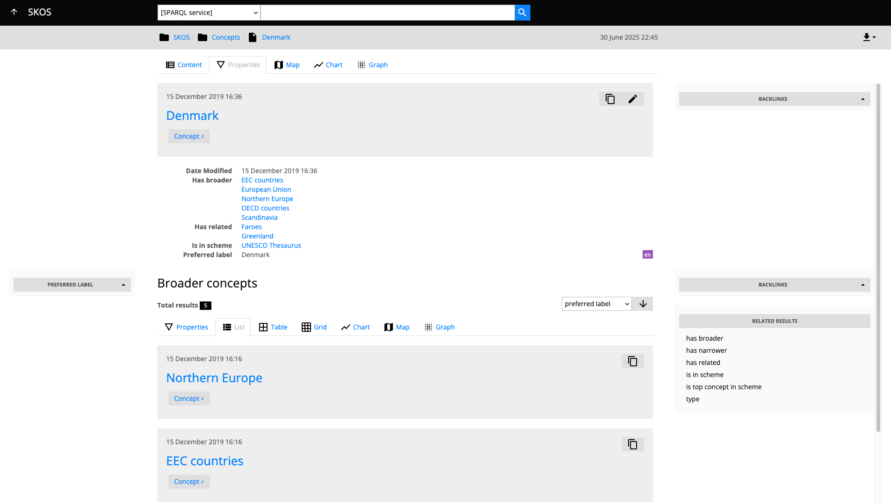

# LinkedDataHub applications

System, demo, and user-submitted applications built on LinkedDataHub. Completely data-driven, no code involved (besides the shell scripts).

## Prerequisites

The installation scripts in this repository use [LinkedDataHub's CLI scripts](https://atomgraph.github.io/LinkedDataHub/linkeddatahub/docs/reference/command-line-interface/). You need to add the `bin` (and its subfolders) of your LinkedDataHub fork or clone to `$PATH`, for example:

```shell
export PATH="$(find bin -type d -exec realpath {} \; | tr '\n' ':')$PATH"
```

__Note that app installation scripts are not idempotent. Subsequent runs might continue adding data but are not guaranteed to succeed.__

## Apps

### Documentation

**The documentation of LinkedDataHub open-source and Cloud versions.**

<dl>
    <dt>Source</dt>
    <dd><a href="../../tree/master/linkeddatahub/docs/">linkeddatahub/docs/</a></dd>
    <dt>Features</dt>
    <dd>XHTML document content is rendered from RDF literals</dd>
    <dt>Lines of code</dt>
    <dd>0 lines of imperative code</dd>
    <dd>164 lines of installation shell scripts</dd>
</dl>

### Northwind Traders

 navigation")

**Knowledge Graph representation of the [Northwind Traders](https://powerapps.microsoft.com/en-us/blog/northwind-traders-relational-data-sample/) sample database.**

<dl>
    <dt>Source</dt>
    <dd><a href="../../tree/master/demo/northwind-traders/" target="_blank">demo/northwind-traders/</a></dd>
    <dt>Live instance</dt>
    <dd><a href="https://linkeddatahub.com/demo/northwind-traders/" target="_blank">https://linkeddatahub.com/demo/northwind-traders/</a></dd>
    <dt>Features</dt>
    <dd>Faceted search</dd>
    <dd>Related results (parallax navigation)</dd>
    <dd>Custom <code>SELECT</code> query for each container that includes links to related resources (1:N relationships) from which faceted search options are generated</dd>
    <dd><a href="https://atomgraph.github.io/LinkedDataHub/linkeddatahub/docs/reference/imports/csv/" target="_blank">Import from CSV</a></dd>
    <dt>Lines of code</dt>
    <dd>0 lines of imperative code</dd>
    <dd>681 lines of SPARQL</dd>
    <dd>951 lines of installation shell scripts</dd>
</dl>

### City Graph


**Browser of Copenhagen's geospatial open data, imported from [Copenhagen Open Data](https://data.kk.dk/). Provides a type-colored geospatial overview. Geo resources provide a view with neighbouring resources included.**

<dl>
    <dt>Source</dt>
    <dd><a href="../../tree/master/demo/city-graph/" target="_blank">demo/city-graph/</a></dd>
    <dt>Live instance</dt>
    <dd><a href="https://linkeddatahub.com/demo/city-graph/" target="_blank">https://linkeddatahub.com/demo/city-graph/</a></dd>
    <dt>Features</dt>
    <dd><a href="https://atomgraph.github.io/LinkedDataHub/linkeddatahub/docs/reference/imports/csv/" target="_blank">Import from CSV</a></dd>
    <dt>Lines of code</dt>
    <dd>0 lines of imperative code</dd>
    <dd>535 lines of SPARQL</dd>
    <dd>488 lines of installation shell scripts</dd>
</dl>

### SKOS




**Basic SKOS editor with a custom UI theme. Concepts and concept schemas can be created, edited, and linked with each other. Ontology types have separate URI templates; required instance properties are validated using constraints.**

_This app uses custom XSLT and CSS stylesheets; those need to be mounted as well as configured in LinkedDataHub to take effect. The max request payload size needs to be increased as well to accomodate the taxonomy file import._ For example:

`.env`:
```
MAX_CONTENT_LENGTH=4194304
```

`docker-compose.override.yml`:
```yaml
services:
  linkeddatahub:
    volumes:
      - ../LinkedDataHub-Apps/demo/skos/files/skos.xsl:/usr/local/tomcat/webapps/ROOT/static/com/linkeddatahub/demo/skos/xsl/bootstrap/2.3.2/layout.xsl:ro
      - ../LinkedDataHub-Apps/demo/skos/files/bootstrap.min.css:/usr/local/tomcat/webapps/ROOT/static/com/linkeddatahub/demo/skos/css/bootstrap.css:ro
```

`config/system-varnish.trig`:
```
<urn:linkeddatahub:apps/end-user> ac:stylesheet <static/com/linkeddatahub/demo/skos/xsl/bootstrap/2.3.2/layout.xsl> .
```

<dl>
    <dt>Source</dt>
    <dd><a href="../../tree/master/demo/skos/" target="_blank">demo/skos/</a></dd>
    <dt>Live instance</dt>
    <dd><a href="https://linkeddatahub.com/demo/skos/" target="_blank">https://linkeddatahub.com/demo/skos/</a></dd>
    <dt>Features</dt>
    <dd><a href="https://atomgraph.github.io/LinkedDataHub/linkeddatahub/docs/reference/stylesheets/" target="_blank">Custom stylesheet</a></dd>
    <dd><a href="https://atomgraph.github.io/LinkedDataHub/linkeddatahub/docs/reference/administration/ontologies/#classes" target="_blank">Classes</a></dd>
    <dd><a href="https://atomgraph.github.io/LinkedDataHub/linkeddatahub/docs/reference/administration/ontologies/#constructors" target="_blank">Constructors</a></dd>
    <dd><a href="https://atomgraph.github.io/LinkedDataHub/linkeddatahub/docs/reference/administration/ontologies/#constraints" target="_blank">Constraints</a></dd>
    <dt>Lines of code</dt>
    <dd>0 lines of imperative code</dd>
    <dd>107 lines of SPARQL</dd>
    <dd>499 lines of installation shell scripts</dd>
    <dd>60 lines of XSLT stylesheet</dd>
</dl>

__You need to request append/write access to be able to create/edit the data.__
